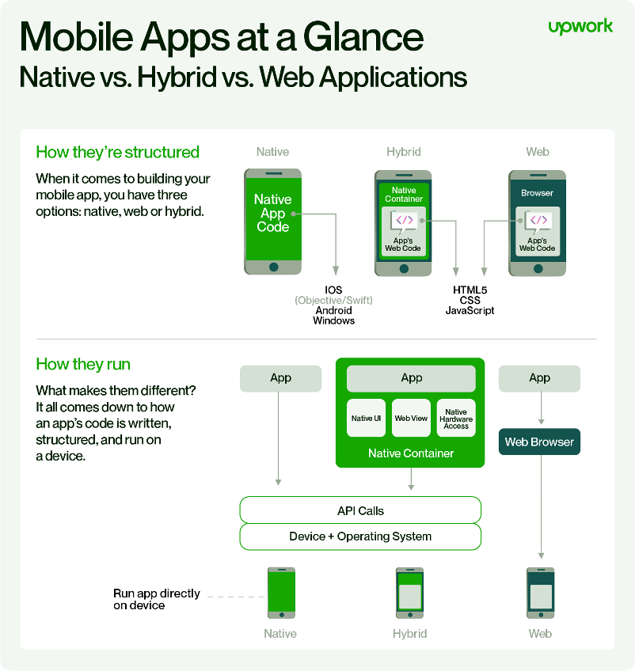

<!-- _class: invert -->

*Grau en Disseny i Desenvolupament de Videojocs*
*Programació de dispositius mòbils*

# Tipus de desenvolupament d'aplicacions per a mòbils

---

Hi ha diversos tipus de desenvolupament d'aplicacions per a mòbils. L'elecció del tipus adequat depèn de diversos factors com les necessitats del projecte, el pressupost i les habilitats dels desenvolupadors.

---
# Desenvolupament natiu

Aplicacions específiques per a iOS o Android.
Llenguatges: Swift, Objective-C (iOS) o Java, Kotlin (Android).
Millor rendiment i accés total a les funcions del dispositiu.

---

# Desenvolupament híbrid

Reutilització de codi per a iOS i Android.
Ionic, React Native o Apache Cordova utilitzen tecnologies web (HTML, CSS, JavaScript).
Flutter fa servir Dart. Xamarin C#.
Eficiència en costos i temps, però lleugerament inferior en rendiment.

---

# Aplicacions Web Progressives (PWA)

Aplicacions web que es poden afegir a la pantalla d'inici.
Funcionen independentment de la plataforma.
Experiència semblant a aplicacions natives, actualització àgil.

---

# Eines Low-Code/No-Code

Crea aplicacions amb poca o nul·la programació.
Adequades per a projectes senzills o amb recursos limitats.
Limitacions en personalització i control.

---

---

L'**elecció del tipus de desenvolupament** dependrà de la complexitat del projecte, les necessitats de l'usuari final i els recursos disponibles. Algunes empreses poden optar per una combinació d'aquests mètodes per arribar a una àmplia audiència i oferir una experiència d'usuari òptima.

