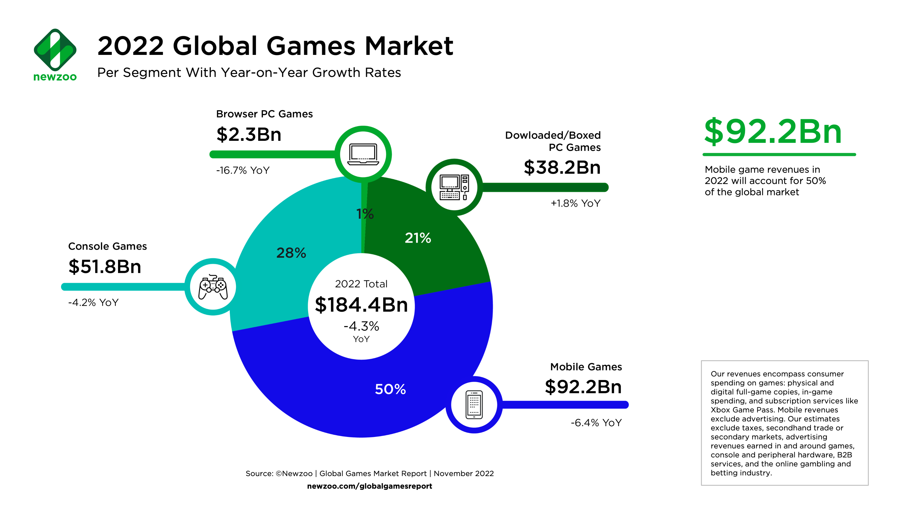

<!-- _class: invert -->

*Grau en Disseny i Desenvolupament de Videojocs*
*Programació de dispositius mòbils*

# Models de negoci i distribució de jocs mòbils

---

---

---

---

El món dels jocs mòbils ofereix una àmplia gamma de models de negoci i estratègies de distribució que afecten la manera com els desenvolupadors generen ingressos i com els jugadors accedeixen als jocs. Aquí tenim una desglossament dels models més comuns:

---

## _Freemium_

**Concepte**: El joc es descarrega i es juga de forma gratuïta, però ofereix compres dins de l'aplicació per a contingut premium, avantatges o moneda virtual.
**Avantatges**: Accessibilitat per a un ampli públic. Els jugadors poden triar gastar en funció del seu interès.

---

## _Premium_

**Concepte**: El joc es ven amb un preu únic inicial sense compres dins de l'aplicació ni publicitat.
**Avantatges**: Ingressos inicials. Pot oferir una millor experiència sense interrupcions publicitàries o compres.

---

## Anuncis publicitaris

**Concepte**: El joc és gratuït però inclou publicitat integrada, com anuncis de pantalla completa, vídeos o banners.
**Avantatges**: Accessibilitat sense cost per als jugadors. Ingressos provinents dels anunciants.

---

## Compres dins de l'aplicació (IAP)

**Concepte**: El joc és gratuït, però els jugadors poden adquirir objectes virtuals, moneda del joc o avantatges mitjançant compres dins de l'aplicació.
**Avantatges**: Pot generar ingressos sostinguts i motivar la interacció continuada dels jugadors.

---

## Subscripcions

**Concepte**: Els jugadors paguen una subscripció periòdica (setmanal, mensual, anual) per accedir a contingut exclusiu, avantatges o actualitzacions regulars.
**Avantatges**: Ingressos constants i fidelització dels jugadors.

---

## _Pay-to-Win_

**Concepte**: El joc ofereix avantatges significatius a aquells jugadors que gasten diners en compres dins de l'aplicació.
**Avantatges**: Pot generar ingressos substancials però pot generar desigualtats entre jugadors.

---

## _Try-and-Buy_

**Concepte**: El joc es pot descarregar i jugar gratuïtament durant un període de temps limitat, o només una part (demo). Després es requereix una compra per continuar.
**Avantatges**: Permet als jugadors provar el joc abans de comprometre's amb una compra.

---

## _Crowdfunding_ (finançament col·lectiu)

**Concepte**: Els desenvolupadors ofereixen la possibilitat als jugadors de finançar el joc abans que sigui llançat, amb recompenses exclusives.
**Avantatges**: Genera un finançament inicial, i els que contribueixen solen ajudar a promocionar el joc i donen retroalimentació durant el desenvolupament.

----

Cada model de negoci té avantatges i desavantatges, i la selecció depèn de l'audiència, la naturalesa del joc i els objectius financers dels desenvolupadors. Una comprensió profunda d'aquests models és essencial per a qualsevol desenvolupador que vulgui crear un joc mòbil d'èxit i generar ingressos sostinguts.

